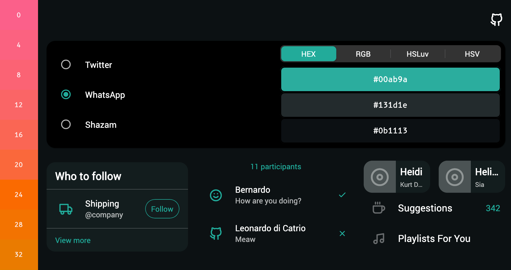

# Fast Dark Theme
This project is a Flutter web experiment. It allows you to prototype dark mode colors based on popular apps: WhatsApp, Twitter and Shazam.
You can select the Hue value you want, and the project will select everything else.

[TRY IT HERE](https://bernaferrari.github.io/fastdarktheme/)

[

](https://bernaferrari.github.io/fastdarktheme/)

I used a standard color picker to capture primary, surface and background color for these apps and converted them to HSLuv in my [Color Studio](https://github.com/bernaferrari/color-studio) app.
This project doesn't have a 100% fidelity with them, but is close enough - Shazam's background, for instance, has a luminescence of 4. That was rounded to 5.

The idea is to help anyone build a coherent theme by modifying successful ones. The logic behind those themes is the most interesting part.

- Hue: always changes from Primary to Background/Surface, from 7 (Twitter) to 38 (Shazam).
- Saturation: can change from Primary to Background and can change from Background to Surface. Twitter and WhatsApp keeps Background and Surface the same. Shazam keeps Primary and Background the same, but changes Surface. 
- Luminescence: Surface and Background always get a difference of 5.

## Reporting Issues

Issues and Pull Requests are welcome.
You can report [here](https://github.com/bernaferrari/fastdarktheme/issues).

## License

    Copyright 2020 Bernardo Ferrari

    Permission is hereby granted, free of charge, to any person obtaining a copy of this software and associated documentation files (the "Software"), to deal in the Software without restriction, including without limitation the rights to use, copy, modify, merge, publish, distribute, sublicense, and/or sell copies of the Software, and to permit persons to whom the Software is furnished to do so, subject to the following conditions:

    The above copyright notice and this permission notice shall be included in all copies or substantial portions of the Software.

    THE SOFTWARE IS PROVIDED "AS IS", WITHOUT WARRANTY OF ANY KIND, EXPRESS OR IMPLIED, INCLUDING BUT NOT LIMITED TO THE WARRANTIES OF MERCHANTABILITY, FITNESS FOR A PARTICULAR PURPOSE AND NONINFRINGEMENT. IN NO EVENT SHALL THE AUTHORS OR COPYRIGHT HOLDERS BE LIABLE FOR ANY CLAIM, DAMAGES OR OTHER LIABILITY, WHETHER IN AN ACTION OF CONTRACT, TORT OR OTHERWISE, ARISING FROM, OUT OF OR IN CONNECTION WITH THE SOFTWARE OR THE USE OR OTHER DEALINGS IN THE SOFTWARE.
